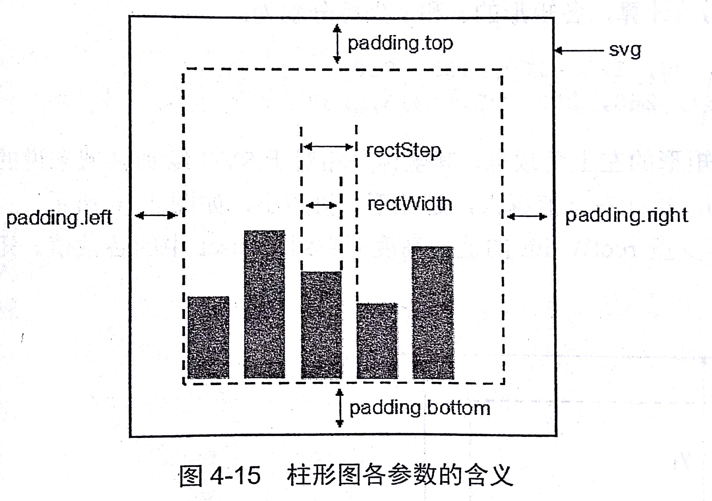
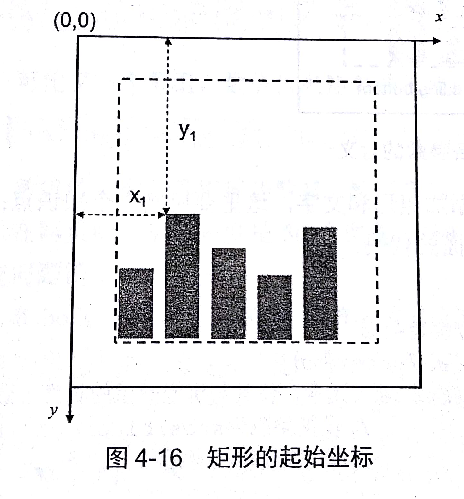

## D3基础：选择集与数据

### <div id="class01-01">01、选择元素</div>

api | 说明
:- | :-
select | 选择多个元素
selectAll | 选择多个元素

类似于jquery 的选择器理解就可以了


### <div id="class01-02">02、选择集</div>
select 和 selectAll 返回的对象就是选择集（selection）                
选择集有如下api

#### 查看状态

api | 说明
:- | :-
empty() | 如果选择集为空，返回true, 反之返回false
node() | 返回第一个非空节点
size() | 返回选择集个数

#### 设置和获取属性

api | 说明
:- | :-
selection.attr(name[, value]) | 获取属性
selection.classed(name [, value]) | 获取class, 第二个参数如果要设置多个class名， 空格隔开就可以了。 第二个属性还可以是一个布尔值，表示开启与关闭， classed还可以携程对象的形式。 如果忽略第二个参数，返回的是一个布尔类型，表示是否开启。
selection.style(name [, value]) | 获取样式， name 为样式名字
selection.property(name [, value]) | 用来获取特殊的属性，比如input中的value
selection.text([value]) | 用来获取标签的文本
selection.html([value]) | 用来获取html字符串

### <div id="class01-03">03、添加、插入和删除</div>

api | 说明
:- | :-
selection.append(name) | 在选择集末尾添加一个元素，name 为元素名称
selection.insert(name [, before]) | 在指定的元素之前添加name元素名称的元素，before是css选择器
selection.remove(name) | 删除选择集中的元素


### <div id="class01-04">04、数据绑定</div>

api | 说明
:- | :-
selection.datum([value]) | 给选择集中的每一个元素都绑定相同的value， 如果没有参数，就返回绑定的值。
selection.data([values [, key]]) | 给选择集中的每一个分别绑定数组values的每一项，key是主键函数。

#### datum 的工作原理
对于选择集中的每一个元素，都为其添加一个__data__ 的属性，属性的值就是selection.datum(value)中的value。               
被绑定的元素可以传递给自己的子元素，对前一段的代码修改作用：
```typescript
import Main from "./Main.js";
class Index {
    protected d3;
    constructor() {
        this.d3 =  (<any>window).d3;
    }

    demo4() {
        let p = this.d3.select('body').selectAll('p');
        p.datum('Thunder').text(function(d,i) {
            return d + ' ' + i;
        })
    }
    
    demo5() {
            let p = this.d3.select('body').selectAll('p');
            p.datum('Thunder')
                .text(function (d, i) {
                    return d +' ' + i;
                })
                .append('span')
                .text(function (d, i) {
                    return ' ' + d;
                })
        }
}

let index: Index = new Index();
index.demo4();
export default Index
```

#### data()的工作原理

**1、区别datum**
data() 第一个参数是一个数组，这个数组的的元素分别对应选择集中的每一个元素。依次赋值的。

**2、理解update、enter、exit**

#### 绑定顺序问题
data() 接受第一个参数是数据数组， 第二个参数是主键函数，使用组件函数可以更改绑定的顺序或者规则。但是前提条件是必须选择集已经绑定有数据才行。
这个地方有BUG 我也不知道是怎么回事儿，所以直接略过。


### <div id="class01-05">05、update/enter/exit</div>
这三个概念太过于简单略过

给一个综合的示例 - demo7：
```typescript
let dataset: Array<number> = [10, 20, 30];
let p = this.d3.select('body').selectAll('p');

let update = p.data(dataset);
let enter = update.enter();
let exit = update.exit();

update.text(function(d) {
    return d;
});

enter.append('p')
    .text(function (d) {
        return d;
    });

exit.remove();
```


### <div id="class01-06">06、选择集的常用方法</div>

#### filter 过滤
```typescript
let dataset: Array<number> = [10, 20, 30];
let p = this.d3.select('body').selectAll('p');

let update = p.data(dataset);
let enter = update.enter();
let exit = update.exit();

update
    .filter(function (d, i) {
        if(d> 0) {
            return true
        } else {
            return false
        }
    })
    .text(function(d) {
    return d;
});

enter.append('p')
    .text(function (d) {
        return d;
    });

exit.remove();
```
满足调教的数据才会做后续的处理


#### 排序 sort
降序如下， 反之升序：
```typescript
let p = this.d3.select('body').selectAll('p');
let persons: Array<any> = [
    {
        id: 6,
        name: '张三'
    },
    {
        id: 9,
        name: '李四'
    },
    {
        id: 3,
        name: '王五'
    }
];
p.data(persons)
    .sort(function (a, b) {
        return b.id-a.id
    })
    .text(function (data) {
        return data.id + ': ' + data.name
    })
```

#### 遍历each 
```typescript
let persons: Array<object> = [
    {
        id: 1001,
        name: '张三'
    },
    {
        id: 1002,
        name: '李四'
    }
];

let p = this.d3.select('body').selectAll('p');

p
    .data(persons)
    .each(function (d, i) {
        d.age = 20;
    })
    .text(function (d, i) {
        return `${d.id} - ${d.name} - ${d.age}`;
    })
```

### 传递call 
call() 允许选择集可以讲自身作为参数传递给某一个函数；
```typescript
function myfun(selection) {
    // 这里做selection 的相关操作
}
this.d3.selectAll('p').call(myfun);
```


### <div id="class01-07">07、常用数组方法</div>

api | 说明
:- | :-
d3.ascending(a,b) | 排序：如果a<b, 返回-1；如果a>b, 返回1； 如果a=b， 返回0.
d3.descending(a,b) | 排序：如果a>b， 返回-1；如果a<b， 返回1；如果1=b, 返回0。
d3.min(array [, accessor]) | 返回数组最小值， accessor是求值前的预处理函数。
d3.max(array [, accessor]) | 返回数组最大值， accessor是求值前的预处理函数。
d3.extent(array [, accessor]) | 返回数组， 最小值和最大值 ， accessor是求值前的预处理函数。
d3.sum(array [, accessor]) | 求和
d3.mean(array [, accessor]) | 求平均数
d3.range([start, ] stop [, step]) | 返回等差数列
d3.shuffle(array) | 随机排列数组
d3.merge(arrays) | arrays 就是数组里面的数组，这个是合并数组操作
`d3.map([object] [, key])` | 构建map， 第一个是源数组， 第二个参数是用于映射的key
map.has(key) | 返回布尔
map.get(key) | 返回对应key的value
map.set(key, value) | 存
map.remove(key) | 删除
map.keys() | 数组形式返回所有map的key
map.values() | 数组形式返回所有map的value
map.entries() | 数组形式返回所有的key 和 value
map.forEach(function) | 三版本
map.each(function) | 四版本
map.empty() | 返回布尔，是否为空
map.size() | 返回映射的大小


#### 求值的示例
请见demo11:               
```typescript
let number:Array<number> = [30, 20, 10, 50, 40];
let min: number = this.d3.min(number);
let max: number = this.d3.max(number);
let extent = this.d3.extent(number);
console.log(min);
console.log(max);
console.log(extent);


let minAcc: number = this.d3.min(number, function(d) {return d*3});
let maxAcc: number = this.d3.max(number, function(d) {return d - 5});
console.log(minAcc);
console.log(maxAcc);

let numbers: Array<number> = [69, 11, undefined, 53, 27, 82, 65, 34, NaN];
let sum:number = this.d3.sum(numbers, function(d) {return d/3});
let mean: number = this.d3.mean(numbers);
console.log(sum);
console.log(mean);
```


#### 生成与操作
太过于简单了，示例就算了， 简单的示例看demo12: 
```typescript
let a: Array<number> = this.d3.range(10);
console.log(a); // 输出 [0, 1, 2, 3, 4, 5, 6, 7, 8, 9]
```

#### map
其实跟es6的map没有多大区别，实例看demo13
```typescript
// 以数组对象persons作为数据源，设定id为主键
let map = this.d3.map(this.persons, function(d) {
    return d.id;
});

console.log(map.has(3));    // true
console.log(map.has(4));    // false
console.log(map.get(3));    // {id: 3, name: "王五"}
console.log(map.get(5));    // undefined
map.set(12, {id: 12, name: '王麻子'});
map.set(3, {id: 3, name: '王小二'});
map.remove(6);
console.log(map.keys());
console.log(map.values());
console.log(map.entries());
console.log('------------');

map.each(function(value, key) {
    console.log(key);
    console.log(value);
});
console.log(map.empty());
console.log(map.size());
```


### <div id="class01-08">08、柱形图</div>
这个作为本章节的BOSS, 自己来做一个柱形图
这个直接贴代码看， 备注都写上：
```typescript
// 矩形的高度
let dataset: Array<number> = [50, 43, 120, 87, 99, 167, 142];

// 创建svg 画布的宽高
let width: number = 400;
let height: number = 400;

let svg = this.d3.select('body').append('svg');
svg.attr('width', width)
    .attr('height', height);

// 定义上下边距
let padding: any = {
    top: 20,
    bottom: 20,
    right: 20,
    left: 20
};

// 矩形所占据的宽度， 包括空白，单位为像素
let rectStep: number = 35;

// 矩形所餐具的宽度， 不包括空白， 单位像素
let rectWidth: number = 30;

// 通过dataset给SVG 添加矩形和文字。
let rect = svg.selectAll('rect');
rect.data(dataset)                                          // 绑定数据
    .enter()
    .append('rect')                                         // 添加元素
    .attr('fill', 'steelblue')                 // 设置颜色
    .attr('x', function (d, i) {                // 设置x 坐标
        return padding.left + i * rectStep;
    })
    .attr('y', function (d) {                    // 设置y 坐标
        console.log(d);
        return height - d - padding.bottom;
    })
    .attr('width', rectWidth)                       // 设置矩形宽度
    .attr('height', function (d) {            // 设置矩形高度
        return d
    })
```

这个地方关于设置Y 的坐标有一个理解的大坑。很难理解。
有两个图如下，可以加强理解                       
                             
                         


