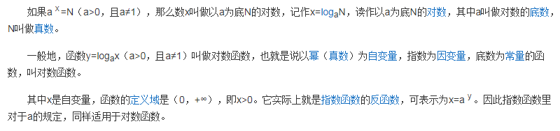

## 02、比例尺与坐标轴

### <div id="class02-01">01、定量比例尺</div>

D3中提供了多种的比例尺，但是都逃不开需要给定**domain(定义域)** 和 **range(值域)**。 最常用的是线性比例尺最标准的用法， 使用如下:
```typescript
import {scaleLinear} from "d3-scale";
let linear = scaleLinear().domain([0, 500]).range([0, 100]);
console.log(linear(50));            // 结果10
console.log(linear(250));           // 结果50
console.log(linear(450));           // 结果90
```

#### 线性比例尺 scaleLinear
```typescript
import {scaleLinear} from "d3-scale";           // 申明
let linear = scaleLinear().domain([0, 500]).range([0, 100]);            // 使用
```

api | 说明
:- | :-
linear(x) | 输入定义域，返回值域
linear.invert(y) | 输入值域， 返回定义域
linear.domain([numbers]) | 设定或者获取定义域
linear.range([values]) | 设定或者获取值域
linear.rangeRound([values]) | 可以代替range() 使用，比例尺的输出值会进行四舍五入的计算， 结果为整数
linear.clamp([boolean]) | 默认false, 超出范围会按照比例得到一个超出范围的值。 如果设置为true, 那么超出范围的值，会压缩到范围内。
linear.nice([count]) | 可以将定义域的范围自动扩展为较为理想的范围。
linear.ticks([count]) | 设定或者获取比较有代表性的值的数目。默认为10， 主要获取坐标轴的刻度。
linear.tickFormat(count [, format]) | 设定定义域内具有代表性的值的表示形式。比如显示到小数点后两位，适用百分比例行使现实数据。

使用实例：
```typescript
import {scaleLinear} from "d3-scale";   
let linear = scaleLinear().domain([0, 20]).range([0, 100]);
console.log(linear(10));            // 获取定义域为10 的值域 结果为 50
console.log(linear(30));                      // 结果150
console.log(linear.invert(80));         // 结果 16

// 如果不希望超出范围
linear.clamp(true);
console.log(linear(30));                        // 100

// 如果希望获取值域的时候四舍五入, 用下面的方法代替range()　方法
linear.rangeRound([0, 100]);
console.log(linear(13.33));                    // 67

// 理想化定义域
linear.domain([0.12300000, 0.4888888]).nice();
console.log(linear.domain());                  // [0.1, 0.5]

// 对于ticks() 和 tickFormat() 的使用
linear = scaleLinear().domain([-20, 20]).range([0, 100]);
let ticks: Array<any> = linear.ticks(5);
console.log('ticks: ', ticks);          //  [-20, -10, 0, 10, 20]

let tickFormat = linear.tickFormat(5, '+');

ticks.map(function(item, index) {
    ticks[index] = tickFormat(ticks[index]);
});
console.log(ticks);         // ["-2e+1", "-1e+1", "+0", "+1e+1", "+2e+1"]
```
其中tickFormat() 第二个参数格式通常有： +  %  $ 等

其他说明：                   
domain() 和 range() 至少放入两个数，但是可以放入多个数，条件是放入数据的数量要相等，可以切分为多个线性情况。这种情况自己试验。


#### 指数标尺和对数标尺: scalePow() | scaleLog()
scalePow() | scaleLog() 这两个标尺和上面的线性标尺拥有的api是一模一样的。 
但是指数标尺多了一个属性 **exponent()** 用于指定指数。
对数标尺对了一个 **base()** 用于指定对数

**额外补充：**
什么是对数：              
             

指数的示例： 只是是指以x为低，y次幂的函数， 这下面这个例子要非常仔细的看。
```typescript
import {scalePow} from "d3-scale";
let pow = scalePow().exponent(3);
console.log(pow(2));            // 8
console.log(pow(3));            // 27

pow.exponent(0.5);
console.log(pow(2));            // 1.4142135623730951
console.log(pow(3));            // 1.7320508075688772

// 指数标尺下的定义域和值域
/*
* 计算结果为11.25 结果分析如下
* 指数标尺使得定义域相对的可以说是扩展为了[0, 3*3*3] = [0, 27]
* 相对于pow(1.5) 就是 3.375 
* 相当于 对应的线性比例尺的结果
* let linear = scaleLinear().domain([0, 27]).range([0, 90]);
* console.log(linear(3.375));     // 11.25
* */
pow.exponent(3)
    .domain([0, 3])
    .range([0, 90]);
console.log(pow(1.5))           // 11.25
```


