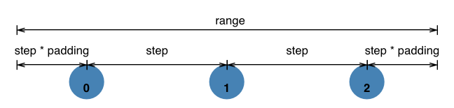
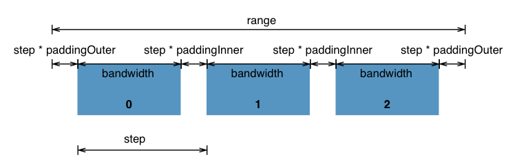
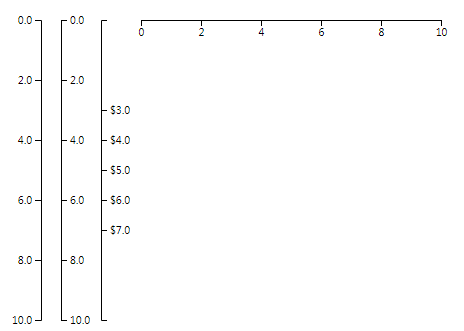

## 02、比例尺与坐标轴

### <div id="class02-01">01、定量比例尺</div>

D3中提供了多种的比例尺，但是都逃不开需要给定**domain(定义域)** 和 **range(值域)**。 最常用的是线性比例尺最标准的用法， 使用如下:
```typescript
import {scaleLinear} from "d3-scale";
let linear = scaleLinear().domain([0, 500]).range([0, 100]);
console.log(linear(50));            // 结果10
console.log(linear(250));           // 结果50
console.log(linear(450));           // 结果90
```

#### 线性比例尺 scaleLinear
```typescript
import {scaleLinear} from "d3-scale";           // 申明
let linear = scaleLinear().domain([0, 500]).range([0, 100]);            // 使用
```

api | 说明
:- | :-
linear(x) | 输入定义域，返回值域
linear.invert(y) | 输入值域， 返回定义域
linear.domain([numbers]) | 设定或者获取定义域
linear.range([values]) | 设定或者获取值域
linear.rangeRound([values]) | 可以代替range() 使用，比例尺的输出值会进行四舍五入的计算， 结果为整数
linear.clamp([boolean]) | 默认false, 超出范围会按照比例得到一个超出范围的值。 如果设置为true, 那么超出范围的值，会压缩到范围内。
linear.nice([count]) | 可以将定义域的范围自动扩展为较为理想的范围。
linear.ticks([count]) | 设定或者获取比较有代表性的值的数目。默认为10， 主要获取坐标轴的刻度。
linear.tickFormat(count [, format]) | 设定定义域内具有代表性的值的表示形式。比如显示到小数点后两位，适用百分比例行使现实数据。

使用实例：
```typescript
import {scaleLinear} from "d3-scale";   
let linear = scaleLinear().domain([0, 20]).range([0, 100]);
console.log(linear(10));            // 获取定义域为10 的值域 结果为 50
console.log(linear(30));                      // 结果150
console.log(linear.invert(80));         // 结果 16

// 如果不希望超出范围
linear.clamp(true);
console.log(linear(30));                        // 100

// 如果希望获取值域的时候四舍五入, 用下面的方法代替range()　方法
linear.rangeRound([0, 100]);
console.log(linear(13.33));                    // 67

// 理想化定义域
linear.domain([0.12300000, 0.4888888]).nice();
console.log(linear.domain());                  // [0.1, 0.5]

// 对于ticks() 和 tickFormat() 的使用
linear = scaleLinear().domain([-20, 20]).range([0, 100]);
let ticks: Array<any> = linear.ticks(5);
console.log('ticks: ', ticks);          //  [-20, -10, 0, 10, 20]

let tickFormat = linear.tickFormat(5, '+');

ticks.map(function(item, index) {
    ticks[index] = tickFormat(ticks[index]);
});
console.log(ticks);         // ["-2e+1", "-1e+1", "+0", "+1e+1", "+2e+1"]
```
其中tickFormat() 第二个参数格式通常有： +  %  $ 等

其他说明：                   
domain() 和 range() 至少放入两个数，但是可以放入多个数，条件是放入数据的数量要相等，可以切分为多个线性情况。这种情况自己试验。


#### 指数标尺和对数标尺: scalePow() | scaleLog()
scalePow() | scaleLog() 这两个标尺和上面的线性标尺拥有的api是一模一样的。 
但是指数标尺多了一个属性 **exponent()** 用于指定指数。
对数标尺对了一个 **base()** 用于指定对数

**额外补充：**
什么是对数：              
             

指数的示例： 只是是指以x为低，y次幂的函数， 这下面这个例子要非常仔细的看。
```typescript
import {scalePow} from "d3-scale";
let pow = scalePow().exponent(3);
console.log(pow(2));            // 8
console.log(pow(3));            // 27

pow.exponent(0.5);
console.log(pow(2));            // 1.4142135623730951
console.log(pow(3));            // 1.7320508075688772

// 指数标尺下的定义域和值域
/*
* 计算结果为11.25 结果分析如下
* 指数标尺使得定义域相对的可以说是扩展为了[0, 3*3*3] = [0, 27]
* 相对于pow(1.5) 就是 3.375 
* 相当于 对应的线性比例尺的结果
* let linear = scaleLinear().domain([0, 27]).range([0, 90]);
* console.log(linear(3.375));     // 11.25
* */
pow.exponent(3)
    .domain([0, 3])
    .range([0, 90]);
console.log(pow(1.5))           // 11.25
```


#### 量子比例尺和分位比例尺: scaleQuantize | scaleQuantile

**量子比例尺**

定义域连续，值域离散。例如：              
定义域： [0, 10]                
值域： ['red', 'green', 'blue', 'yellow', 'black']

这样定义域被分为5段，每一段对应一个值，前开后闭的方式对应的。 示例如下：
```typescript
import {scaleQuantize} from "d3-scale";
let quantize = scaleQuantize().domain([0, 10]).range([1, 2, 3, 4, 5]);
console.log(Method.getColor(quantize(1)));                  // red
console.log(Method.getColor(quantize(3)));                  // green
console.log(Method.getColor(quantize(5.999)));              // blue
console.log(Method.getColor(quantize(6)));                  // yellow
```
这个地方需要说明的是，由于ts的强类语言限制，range([])数组里面只能是number 类型，但是我们要匹配字符串，这个时候，就可以利用其它的辅助函数，更加灵活的来实现这个东西。                 
例如下面我们就定义了一个Method类，有一个getColor的静态函数来处理这个问题。
```typescript
class Method {
    static getColor(number: number) {
        switch (number) {
            case 1: return 'red';
            case 2: return 'green';
            case 3: return 'blue';
            case 4: return 'yellow';
            case 5: return 'black';
            default: return 'white';
        }
    }
}
```

用量子比例尺来做一个实际的使用： 画五个圆， 半径越来越小，颜色越来越深
```typescript

import {ScaleQuantize, scaleQuantize} from "d3-scale";
import Method from "./Method";
import {select} from "d3-selection";
import {descending} from "d3-array";

let quantize: ScaleQuantize<number> = scaleQuantize().domain([0, 50]).range([5, 4, 3, 2, 1]);

// 定义一个圆的半径
let r: Array<number> = [45, 35, 25, 15, 5];

// 添加svg
let svg = select('body').append('svg')
    .attr('width', 400)
    .attr('height', 400);

// 添加圆
svg.selectAll('circle')
    .data(r)
    .enter()
    .append('circle')
    .sort(descending)
    .attr('cx', function (d, i) {
        return 50 + i * 30;
    })
    .attr('cy', 50)
    .attr('r', function(d) {
        return d
    })
    .attr('fill', function (d) {
        return Method.getColorCode(quantize(d))
    })
```

**分位比例尺**
分位比例尺和量子比例尺非常像， 区别： **量子比例尺的分断值只与定义域的开始值和结束值有关**，中间无论有多少其它数值都没有影响。**分位比例尺的分段值与定义域中存在的数值都有关**。
简而言之，分段比例尺每一段都对应所有的离散值域数。               
实例如下：
```typescript
import {ScaleQuantile, scaleQuantile, ScaleQuantize, scaleQuantize} from "d3-scale";

// 量子比例尺
let quantize: ScaleQuantize<number> = scaleQuantize().domain([0, 10]).range([1,100]); // scaleQuantize().domain([]) 只允许给定两个值

// 分位比例尺
let quantile: ScaleQuantile<number> = scaleQuantile().domain([0,2,4,10]).range([1, 100]);
console.log(quantize(3));               // 1
console.log(quantile(3));               // 100

console.log(quantize(4.99));            // 1
console.log(quantize(5));               // 100
console.log(quantile(2.99));            // 1
console.log(quantile(3));               // 100
```

#### 阈值比例尺 scaleThreshold
通过设定阈值， 将联系的定义域映射到离散的值域中去。                  
```typescript
let threshold: ScaleThreshold<number, number> = scaleThreshold().domain([10, 20, 30]).range(range(1, 5));
console.log(Method.getColor(threshold(5)));                 // 1 - range
console.log(Method.getColor(threshold(15)));                // 2 - green
console.log(Method.getColor(threshold(25)));                // 3 - blue
console.log(Method.getColor(threshold(35)));                // 4 - yellow

console.log(threshold.invertExtent(1));                 // [undefined, 10]
console.log(threshold.invertExtent(2));                 // [10, 20]
console.log(threshold.invertExtent(3));                 // [20, 30]
console.log(threshold.invertExtent(4));                 // [30, undefined]
```
定义了三个阈值： 10、20、30 ； **空间被三个阈值分为了四段，分别对应： [-∞, 10], (10, 20], (20, 30], (30, ∞] 这样的四段数据， 就对应的range()里面的四个值。**                    
这里阈值比例尺还可以使用一个api ： **invertExtent()**通过值域求出定义域范围。


### <div id="class02-02">02、序数比例尺 scaleOrdinal </div>
序数比例尺是定义域和值域都是离散的。

api | 说明
:- | :-
scaleOrdinal() | 构建一个序数比例尺
ordinal(x) | 通过定义域获取值域
ordinal.domain([values]) | 设定或者获取定义域
ordinal.range([values]) | 设定或者获取值域


**简单的一一对应的例子：**
```typescript
let ordinal = scaleOrdinal().domain(['1', '2', '3', '4', '5']).range([10, 20, 30, 40, 50]);
console.log(ordinal('1'));              // 10
console.log(ordinal('2'));              // 20
console.log(ordinal('3'));              // 30
console.log(ordinal('4'));              // 40
console.log(ordinal('5'));              // 50
console.log(ordinal('8'));              // 10
```
定义域5个数字，对应值域5个，如果超出的输出为10。


**对于scalePoint() 的理解**     

api | 说明
:- | :-   
scalePoint.range(interval) 、scalePoint.padding([padding]) | 设定值域。接受一个连续的区间，根据定义域中离散值的数量将其分段。
scalePoint.range(interval ) | 跟rangePoints() 是一样的，但是结果会取整数。
point.step() | 返回相邻点开始点之间的距离。

                  
要理解这个东西，就要看看下面这个图：                  
                                       
这里的range就是rangePoint() 的第一个参数interval的值，是一个范围， 比如[0, 100]; padding是第二个参数；step 是根据定义域的数量计算得到的一个值。上图圆圈代表点， 就是计算得到的离散值。                
请看demo9:                
```typescript
let point = scalePoint().domain(['1', '2', '3', '4', '5']).range([0, 100]);
console.log(point.range());         // [0, 100]
console.log(point('1'));            // 0
console.log(point('3'));            // 50
console.log(point('5'));            // 100

point.padding(5);
console.log(point.range());         // [0, 100]
console.log(point('1'));            // 16.666666666666664
console.log(point('2'));            // 33.33333333333333
console.log(point('3'));            // 50
console.log(point('4'));            // 66.66666666666666
console.log(point('5'));            // 83.33333333333334
```


**对于 scaleBand() 的理解**                  

要理解这个东西，就要看看下面这个图：  
                     

api | 说明
:- | :-   
band(value) | 给定输入域中的一个值，返回从输出范围派生的相应频带的开始。如果给定的值不在范围内，则返回未定义的值。
band.paddingInner([padding]) | 如果指定了内边距，则将内边距设置为指定的值，该值必须在范围[0,1]内。如果未指定填充，则返回默认为0的当前内部填充。内部填充决定为带之间的空白空间保留的范围的比率。
band.paddingOuter([padding]) | 如果指定了padding，则将外层的padding设置为指定的值，该值必须在范围[0,1]内。如果未指定填充，则返回默认为0的当前外部填充。外边距决定在第一个边距之前和最后一个边距之后为空白空间保留的范围的比率。
band.padding([padding]) | 将内边距和外边距设置为相同边距值的一种简便方法。如果未指定填充，则返回内部填充。
band.bandwidth() | 返回每个频带的宽度。
band.step() | 返回相邻频带起始点之间的距离。

实例请看demo10:                 
```typescript
let bands = scaleBand().domain(['1', '2', '3', '4', '5']).range([0, 100]);
console.log(bands.range());         // [0, 100]
console.log(bands.bandwidth());     // 20
console.log(bands.step());          // 20

bands.paddingInner(0.5)
    .paddingOuter(0.2);
console.log(bands.range());         // [0, 100]
console.log(bands.bandwidth());     // 10.204081632653061
console.log(bands.step());          // 20.408163265306122
console.log(bands('1'));            // 4.081632653061227
console.log(bands('2'));            // 24.48979591836735
console.log(bands('3'));            // 44.89795918367347
console.log(bands('4'));            // 65.3061224489796
console.log(bands('5'));            // 85.71428571428572
```

**颜色比例尺**

api | 说明
:- | :-   
d3.schemeCategory10 | 
d3.schemeAccent | 
d3.schemeDark2 | 
d3.schemePaired | 
d3.schemePastel1 | 
d3.schemePastel2 |
d3.schemeSet1 |
d3.schemeSet2 |
d3.schemeSet3 |

啥都不说，直接上代码， 请看demo11:               
```typescript
let width: number = 600;
let height: number = 600;
let dataSet: Array<number> = range(5);

// 定义色彩
let color: ReadonlyArray<string> = schemeCategory10;

let svg = select('body').append('svg');
svg.attr('width', width);
svg.attr('height', height);

// 绘制圆形
let circle = svg.selectAll('circle')
    .data(dataSet)
    .enter()
    .append('circle')
    .attr('cx', function(d, i ) {
        return  100 + i * 80;
    })
    .attr('cy', 100)
    .attr('r', 30)
    .attr('fill', function (d, i) {
        return color[i];
    })
```

### <div id="class02-03">03、坐标轴</div>

api | 说明
:- | :-  
d3.axisTop(scale) | 为给定的刻度构造一个新的面向上的轴生成器，带空的刻度参数，刻度大小为6，填充为3。在这个方向上，刻度画在水平域路径之上。
d3.axisRight(scale) | 为给定的刻度构造一个新的面向右的轴生成器，带空的刻度参数，刻度大小为6，填充为3。在这个方向上，刻度被画到垂直域路径的右边。
d3.axisBottom(scale) | 为给定的刻度构造一个新的面向底部的轴生成器，带有空的刻度参数，刻度大小为6，填充为3。在这个方向上，刻度画在水平域路径下面。
d3.axisLeft(scale) | 为给定的刻度构造一个新的面向左的轴生成器，带空的刻度参数，刻度大小为6，填充为3。在这个方向上，刻度被画在垂直域路径的左边。
axis(context) | 将轴呈现给给定的上下文，它可以是SVG容器(SVG或G元素)的选择，也可以是相应的转换。
axis.ticks([count[, specifier]]) 、 axis.ticks([interval[, specifier]]) | 参数的含义取决于轴的刻度类型:最常见的是，参数是建议的刻度数(或时间刻度的时间间隔)，以及可选的格式说明符，用于自定义刻度值的格式化方式。要显式地设置滴答值，请使用axis.tickValues。要显式设置滴答格式，请使用axis.tickFormat。
axis.tickArguments([arguments]) | 使用方法基本上和上面是一样的。
axis.tickValues([values]) | 设定或者获取坐标的指定刻度
axis.tickFormat([format]) | 设定或者获取坐标的单位
axis.tickSize([size]) | 如果指定了大小，将内部和外部刻度大小设置为指定的值，并返回轴。如果没有指定大小，返回当前的内刻度大小，默认为6。
axis.tickSizeInner([size]) | 设定或者获取坐标轴内部度的长度。内部度指的是非两端的刻度。
axis.tickSizeOuter([size]) | 设定或者获取外部度。 外部度值的是两端的刻度。


#### 绘制方法
绘制方法一般来说，第一步绘制svg, 第二步绘制比例尺， 第三步制定坐标，第四步吧坐标给g元素回调
请看demo13:
```typescript
let width:number = 600, height: number = 600;
let svg = select('body').append('svg')
    .attr('height', height)
    .attr('width', width);

// 用于坐标轴的线性比例尺
let xScale = scaleLinear().domain([0,10]).range([0, 300]);

// 坐标轴
let axis = axisBottom(xScale);

// 在svg中添加一个包含坐标各个元素的g元素
let gAxis = svg.append('g')
    .attr('transform', `translate(80, 80)`);         // 平移到（80，80）

gAxis.call(axis);
```

#### 刻度
通常为 方向、间隔、长度、文字格式等。
```typescript
let width: number = 600, height: number = 600;
let svg = select('body').append('svg')
    .attr('height', height)
    .attr('width', width);

// 用于坐标轴的线性比例尺
let xScale = scaleLinear().domain([0, 10]).range([0, 300]);

// 坐标轴
let leftAxis = axisLeft(xScale).ticks(5, '.1f');
let leftAxis2 = axisBottom(xScale).ticks(5).tickSizeInner(1).tickSizeOuter(5);
let rightAxis = axisRight(xScale).ticks([5], '.1f');
let rightAxis2 = axisRight(xScale).tickValues([3, 4, 5, 6, 7]).tickFormat(format("$.1f"));


// 在svg中添加一个包含坐标各个元素的g元素
let lAxis = svg.append('g')
    .attr('transform', `translate(80, 80)`);         // 平移到（80，80）

let rAxis = svg.append('g')
    .attr('transform', `translate(100, 80)`);         // 平移到（80，80）

let rAxis2 = svg.append('g')
    .attr('transform', `translate(140, 80)`);         // 平移到（80，80）

let lAxis2 = svg.append('g')
    .attr('transform', `translate(180, 80)`);

lAxis.call(leftAxis);
lAxis2.call(leftAxis2);
rAxis.call(rightAxis);
rAxis2.call(rightAxis2);
```
绘制效果如下：                 
                 


