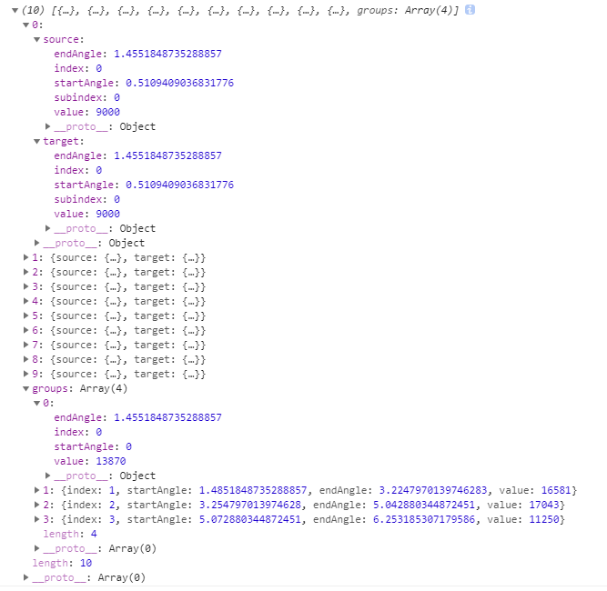

## 布局

### <div id="class07-01">01、饼状图</div>

api | 说明
:- | :- 
d3.pie() | 构建一个新的使用默认配置的 **pie 生成器**。
pie(data[, arguments…]) | 根据指定的**data 数组生成一组对象数组**，其中每个对象包含每个传入的数据经过计算后的角度信息。data - 输入数据; 对应输入数组中的数据元素.
pie.value([value]) | 如果指定了 value 则设置当前饼图生成器的值访问器为指定的函数或数值，并返回当前饼图生成器。如果没有指定 value 则返回当前的值访问器
pie.sort([compare]) | 如果指定了 compare 则将数据比较函数设置为指定的函数并返回饼图生成器。
pie.startAngle([angle]) |  如果指定了 angle 则将饼图的布局起始角度设置为指定的函数或数值并返回饼图生成器。
pie.endAngle([angle]) | 如果指定了 angle 则将整个饼图的终止角度设置为指定的函数或数值并返回当前饼图生成器。
pie.padAngle([angle]) | 如果指定了 angle 则将饼图扇形之间的间隔设置为指定的函数或数值，并返回当前饼图生成器。

**说明**                  
pie(data[, arguments…])：        
返回数组中的每个对象包含以下属性:               
data - 输入数据; 对应输入数组中的数据元素.              
value - arc 对应的 value.              
index - arc 基于 0 的 sorted index(排序后的索引).            
startAngle - arc 的 start angle.                     
endAngle - arc 的 end angle.                 
padAngle - arc 的 pad angle.                 

```typescript
var data = [1, 1, 2, 3, 5, 8, 13, 21];
var arcs = d3.pie()(data);
```
pie() constructs(构造) 一个默认的 pie 生成器。pie()(data) 为指定的数据集 invokes(调用) 饼图生成器，返回一组对象数组:
```json
[
  {"data":  1, "value":  1, "index": 6, "startAngle": 6.050474740247008, "endAngle": 6.166830023713296, "padAngle": 0},
  {"data":  1, "value":  1, "index": 7, "startAngle": 6.166830023713296, "endAngle": 6.283185307179584, "padAngle": 0},
  {"data":  2, "value":  2, "index": 5, "startAngle": 5.817764173314431, "endAngle": 6.050474740247008, "padAngle": 0},
  {"data":  3, "value":  3, "index": 4, "startAngle": 5.468698322915565, "endAngle": 5.817764173314431, "padAngle": 0},
  {"data":  5, "value":  5, "index": 3, "startAngle": 4.886921905584122, "endAngle": 5.468698322915565, "padAngle": 0},
  {"data":  8, "value":  8, "index": 2, "startAngle": 3.956079637853813, "endAngle": 4.886921905584122, "padAngle": 0},
  {"data": 13, "value": 13, "index": 1, "startAngle": 2.443460952792061, "endAngle": 3.956079637853813, "padAngle": 0},
  {"data": 21, "value": 21, "index": 0, "startAngle": 0.000000000000000, "endAngle": 2.443460952792061, "padAngle": 0}
]
```

demo1: 饼状图
```typescript
let dataSet: any = [
    ['小米', 60.8], ['三星', 58.4], ['联想', 47.3], ['苹果', 46.6],
    ['华为', 41.3], ['酷派', 40.1], ['其他', 111.5]
];

let pieMain = pie().value(function (d) {
    return d[1]
});
let pieData = pieMain(dataSet);
console.log(pieData);

let outerRadius = this.width / 3;
let innerRadius = 0;

let arcMain = arc()
    .innerRadius(innerRadius)
    .outerRadius(outerRadius);

let color = schemeCategory10;

let arcs = this.svg.selectAll('g')
    .data(pieData)
    .enter()
    .append('g')
    .attr('transform', `translate(${this.width / 2}, ${this.height / 2})`);

arcs.append('path')
    .attr('fill', function (d: any, i: number) {
        return color[i];
    })
    .attr('d', function (d: any) {
        return arcMain(d);
    });

// 添加文字
arcs.append('text')
    .attr('transform', function (d: any) {
        let x: number = arcMain.centroid(d)[0] * 1.4;
        let y: number = arcMain.centroid(d)[1] * 1.4;
        return `translate(${x}, ${y})`
    })
    .attr('text-anchor', 'middle')
    .attr('fill', 'white')
    .attr('font-size', 18)
    .text(function (d: any) {
        let percent: number = d.value / sum(dataSet, function (d: any) {
            return d[1];
        }) * 100;
        return percent.toFixed(2) + '%';
    });

// 添加链接弧外文字的直线元素
arcs.append('line')
    .attr('x1', function (d: any) {
        return arcMain.centroid(d)[0] * 2;
    })
    .attr('y1', function (d: any) {
        return arcMain.centroid(d)[1] * 2;
    })
    .attr('x2', function (d: any) {
        return arcMain.centroid(d)[0] * 2.2;
    })
    .attr('y2', function (d: any) {
        return arcMain.centroid(d)[1] * 2.2;
    })
    .attr('stroke', 'black');

// 添加文字
arcs.append('text')
    .attr('dy', '.35em')
    .attr('text-anchor', 'middle')
    .attr('transform', function (d: any) {
        let x: number = arcMain.centroid(d)[0] * 2.4;
        let y: number = arcMain.centroid(d)[1] * 2.4;
        return `translate(${x}, ${y})`
    })
    .text(function (d: any) {
        return d.data[0];
    })
```


### <div id="class07-02">02、力导向图</div>
#### 参考文章：                                              
- [示例1 - 经典文章: D3.js的v5版本入门教程（第十四章）—— 力导向图](https://blog.csdn.net/qq_34414916/article/details/80036679)
- [示例2 - 入门示例](./01、四版本的力导向图示例.html)
- [示例3 - 解析文章](https://www.jianshu.com/p/8a5b7f43c381)
- [示例3 - 超复杂示例](./02、D3%20力导向图示例%20-%20复杂示例/force.html)
- [示例4 - 文章: 入门级文章](https://blog.csdn.net/tengxing007/article/details/59712572)

#### api和使用说明

api | 说明
:- | :- 
**d3.forceSimulation** | 创建一个新的力学仿真.
simulation.restart | 重新启动仿真的定时器.
simulation.stop | 停止仿真的定时器.
simulation.tick | 进行一步仿真模拟.
simulation.nodes | 设置仿真的节点.
simulation.alpha | 设置当前的 alpha 值.
simulation.alphaMin | 设置最小 alpha 阈值.
simulation.alphaDecay | 设置 alpha 衰减率.
simulation.alphaTarget | 设置目标 alpha 值.
simulation.velocityDecay | 设置速度衰减率.
simulation.force | 添加或移除一个力模型.
simulation.find | 根据指定的位置找出最近的节点.
simulation.on | 添加或移除事件监听器.
force | 应用力模型.
force.initialize | 根据指定的节点初始化力模型.
**d3.forceCenter** | 创建一个中心作用力.
center.x | 设置中心作用力的 x -坐标.
center.y | 设置中心作用力的 y -坐标.
**d3.forceCollide** | 创建一个圆形区域的碰撞检测力模型.
collide.radius | 设置碰撞半径.
collide.strength | 设置碰撞检测力模型的强度.
collide.iterations | 设置迭代次数.
**d3.forceLink** | 创建一个 link(弹簧) 作用力.
link.links | 设置弹簧作用力的边.
link.id | 设置边元素中节点的查找方式是索引还是 id 字符串.
link.distance | 设置 link 的距离.
link.strength | 设置 link 的强度.
link.iterations | 设置迭代次数.
**d3.forceManyBody** | 创建一个电荷作用力模型.
manyBody.strength | 设置电荷力模型的强度.
manyBody.theta | 设置 Barnes–Hut 算法的精度.
manyBody.distanceMin | 限制节点之间的最小距离.
manyBody.distanceMax | 限制节点之间的最大距离.
**d3.forceX** | 创建一个 x -方向的一维作用力.
x.strength | 设置力强度.
x.x | 设置目标 x -坐标.
**d3.forceY** | 创建一个 y -方向的一维作用力.
y.strength | 设置力强度.
y.y | 设置目标 y -坐标.
**d3.forceRadial** | 创建一个环形布局的作用力.
radial.strength | 设置力强度.
radial.radius | 设置目标半径.
radial.x | 设置环形作用力的目标中心 x -坐标.
radial.y | 设置环形作用力的目标中心 y -坐标.

#### **其他说明：**                   
- 1、在定义表现之类的作用点的时候， 一定要记住节点永远要至少比变现多一个。                         
```typescript
    private nodes: { name: string }[] = [
        {name: '1'},
        {name: '2'},
        {name: '3'},
        {name: '4'},
        {name: '5'},
        {name: '6'},
        {name: '7'},
    ];

    private edges: any[] = [
        {source: 0, target: 1},
        {source: 0, target: 2},
        {source: 0, target: 3},
        {source: 1, target: 4},
        {source: 1, target: 5},
        {source: 1, target: 6}
    ];
```
如上，就有node 7 个， edges7个；    

- 02、力学仿真对象返回node属性含义：

属性 | 含义
:- | :- 
 index | 节点在 nodes 数组中的索引
 x | 节点当前的 x-坐标
 y | 节点当前的 y-坐标
 vx | 节点当前的 x-方向速度
 vy | 节点当前的 y-方向速度
 
 位置 ⟨x,y⟩ 以及速度 ⟨vx,vy⟩ 随后可能被仿真中的 forces 修改. 如果 vx 或 vy 为 NaN, 则速度会被初始化为 ⟨0,0⟩. 如果 x 或 y 为 NaN。                          
 
 
如果想要某个节点固定在一个位置，可以指定以下两个额外的属性:

属性 | 含义
:- | :- 
fx | 节点的固定 x-位置
fy | 节点的固定 y-位置


具体实例和代码请看:                  
[demo2-一个比较全面的基础实例](./Demo2.ts)                             
[demo3-书籍上面的一个简单实例](./Demo3.ts)


### <div id="class07-03">03、弦图</div>
用于表示一组元素之间的关系。

#### 参考文章：                      
- [弦图的制作-入门级别3版本](https://blog.csdn.net/lzhlzz/article/details/38299899)                    
- [经典官方实例](https://blog.csdn.net/wan353694124/article/details/78738929)                         
- [D3__chord layout 3版本的一个实例](https://blog.csdn.net/qq_31396185/article/details/79766565)                           
- [带交互的弦图 4版本](https://blog.csdn.net/dkr380205984/article/details/81666656)                 


api | 说明
:- | :- 
d3.chord | 创建一个新的弦图布局.
chord | 根据指定的方阵计算布局.
chord.padAngle | 设置相邻的分组之间的间隔
chord.sortGroups | 定义分组排序规则
chord.sortSubgroups | 定义分组内部子分组的排序规则
chord.sortChords | 定义弦之间的排序规则
d3.ribbon | 创建一个 ribbon(弦)生成器

ribbon | 根据指定的数据返回一个 path 路径以表示弦.
ribbon.source | 设置 ribbon 的源访问器.
ribbon.target | 设置 ribbon 的目标访问器.
ribbon.radius | 设置 ribbon 的半径.
ribbon.startAngle | 设置 ribbon 的起始角度访问器.
ribbon.endAngle | 设置 ribbon 的终止角度访问器.
ribbon.context | 设置渲染上下文(canvas).

**说明：**         

**1、关于chord(matrix)**                       
                         
chord(matrix) 的返回值是一组 chords ，chord 表示两个节点 i 和 j 之间的流量大小，为对象类型，包含以下属性:                  

- source - 该弦的源子分组对象                    
- target - 该弦的目标子分组对象                       

每一个 source 和 target 子分组都有以下数属性:                         

- startAngle - 起始角度                     
- endAngle - 终止角度                   
- value - matrix[i][j] 的值                   
- index - 索引 i                      
- subindex - 索引 j       
                
弦数据通常传递给 d3.ribbon 来显示相互之间的流量关系。     

                     
弦图数组也包含了另一个表示分组的属性 **chords.groups**, chords.groups表示计算后的分组数组，每个分组包含以下属性:

- startAngle - 起始角度               
- endAngle - 终止角度                           
- value - 从节点 i 出去的总量                     
- index - 节点索引 i                      

分组数据传递给d3.arc来绘制。

#### 示例                 
- [ChordDemo - 官方示例](../03、绘制/ChordDemo.ts)                
- [书籍上的示例改造为5版本ts](./Demo5.ts)


